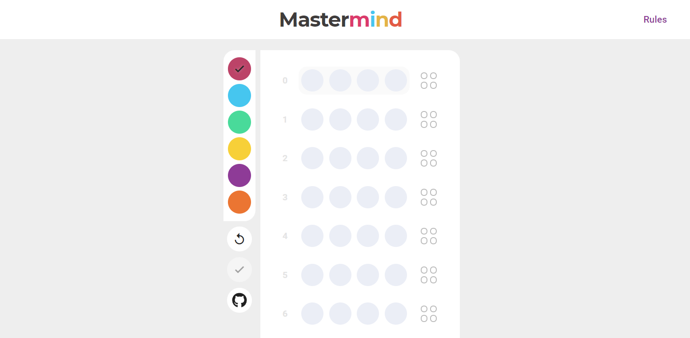

<div id="top"></div>

<br />
<div align="center">
  <h1 align="center">Mastermind</h1>

  <p align="center">
     Guess a secret code consisting a series of 4
colors
  </p>
</div>

## Demo

Here is a quick demo of the app. I hope you enjoy it.

> [The Demo Link](https://naim30.github.io/mastermind-game/)

## About The Project



I build mastermind game using react. In which you guess secret code of four color generated by computer.
<br>

- you can find rules of the game from "Rules" button. and you got 10 chances to predict right secret code.

Here's why:

- I want to create fun project using react.

Show me your smartness and guess correct secret code.

## Built With

To build this Game I used..

- React JS

## Getting Started

step 1 : Clone the repo

```sh
git clone https://github.com/naim30/svg-editor.git
```

step 2 : Install libraries

```sh
cd svg-editor
npm install
```

step 3 : Open the app in localhost

```sh
npm start
```

## Contact

Naimish Lukhi :
Email - naimlukhi30@gmail.com :
[LinkedIn](https://www.linkedin.com/in/naimish-lukhi-a2b14a1b9)

Project Link: [https://github.com/naim30/mastermind-game](https://github.com/naim30/mastermind-game)

<p align="right">(<a href="#top">back to top</a>)</p>
